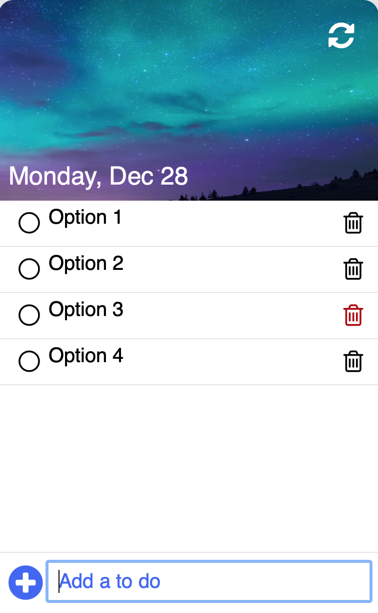

# To do lista

## Table of contents
* [General info](#general-info)
* [Technologies](#technologies)

  

## General info
To do lista in JavaScript

## Technologies
Project is created with:
* JavaScript
* CSS3
* HTML5

[DEMO](https://codeandrepeat.github.io/ToDoList/)